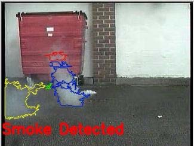
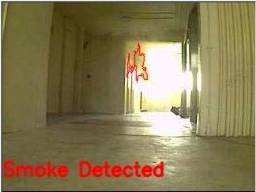
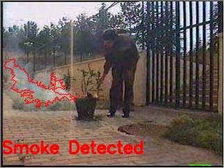
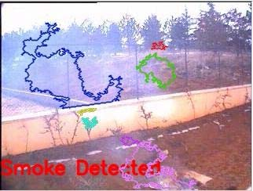
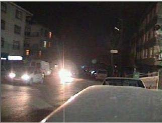
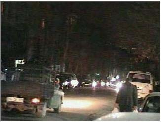
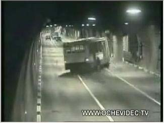
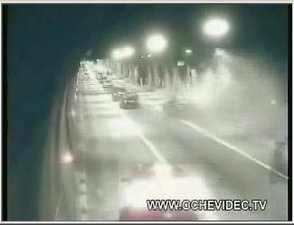

# Розробка системи ідентифікації диму на відео для локалізації пожежі
1. Вивчення предметної області
1.1. Способи локалізації пожеж (аналіз)
1.1.1. Теплові датчики
1.1.2. Датчики вогню
1.1.3. Газові датчики
1.1.4. Димові оптичні датчики
1.1.5. Іонізаційні датчики
1.1.6. Ручні сповіщувачі
1.1.7. Ультразвукові сповіщувачі
1.2. Вивчення характеристик диму.
1.2.1. Flickering
1.2.3. Enegry analisys
2. Аналіз існуючих методів ідентифікації зображень. (найти методи для характеристик, анализ, обоснования выбраных методов для решение задачи) (теор часть) 
 3. Синтез метода (ов) для решения задачи для нахождения дима на изобр.)
 4. Оценка эф. Метода (не требующая экспер., еффект т.к. не нужно доп вложений для покупки АО)
 5. Разработка алгоритмов и прогр обеспеч.
 6. Экспер оценка эф.
 6.1. Порівняння покращеного метода з існуючими.

## Способи локалізації пожеж

### Теплові датчики
Даний тип датчиків є одним із найстаріших видів датчиків пожеж.
Він був розроблений в 1890 році Френсісом Аптоном. Даний датчик 
складався із електричної батареї, колокольного куполу, магніту та
термостатичного пристрою. Термостатичний пристрій знаходив аномальну
кількість тепла. Після того як була знайдена температура вища ніж деякий поріг,
контур між магнітом та батареєю замикався. При цьому молоточок ударяв по куполу,
створюючи попереджувальний сигнал для людей, які знаходилися в приміщенні.

Існують декілька видів теплових датчиків: точечний, багатоточечний та лінійний.
Точечні датчики відрізняються від багатоточечних тим, що у останніх замість одного термостатичного елемента вбудовано декілька, які є рознесеними в просторі.

Ліній теплові датчики поділяються на напівпровідникові, механічні та електромеханічні. В лінійних напівпровідникових теплових датчиках в якості термостатичних елементів використовуються покриття проводів речовиною з від’ємним температурним коефіцієнтом. При взаємодії температури на кабель змінюється опір провідника в точці взаємодії. За зміною опору стежить блок керування. Механічні лінійні теплові датчики в якості термостатичного елемента використовують герметичну металічну трубку, заповнену газом, а також датчик тиску, приєднаний до блоку керування. При взаємодії температури в трубі змінюється тиск газу, який реєструє блок керування. Довжина труби має обмеження в розмірі 300 метрів. Електромеханічні лінійні датчики в якості теплового сенсора використовують термочутливий матеріал, який наноситься на два механічно натянуті проводи. При взаємодії з теплом, термочутливий матеріал розмягчається і два проводи накоротко замикаються. 

Дані датчики використовуються тільки тоді, коли на початкових стадіях пожежі
виділяється достатня кількість тепла. Для того, щоб датчик працював коректно
він повинен бути розміщений на відстані 10-23 см від стелі, оскільки саме там
знаходиться поле найбільшої температури

### Датчики вогню
Датчики вогню реагують на електромагнітне випромінювання вогню. Такі датчики характеризуються спектральною чутливістю. Спектральна чутливість - це чутливість фотоприймача до випромінювання з різними довжинами хвиль. Вона визначається природою матеріалу, з якого зроблений світлочутливий шар. Для вимірювання випромінювання у вузькому діапазоні використовуються світлофільтри. Вони представляють собою пластини, які пропускають світло визначеної довжини хвилі. Для видимої частини спектру використовуються кольорове скло, а для інфрачервоних фільтрів - слюда, кам’яна сіль, бромистий калій, тощо.

Існують дачтики вогню на 3 областях спекру електромагнітного випромінювання: видимого, ульрафіолетового та інфрачервоного випромінювання.

Датчики в області ультрафіолетовго випромінювання з’явилися не так давно, але з кожним днем вони стають все популярнішими. Такий ріст популярності викликаний тим, що земна атмосфера захищає нас від сонячних ультрафіолетових променів, в результаті чого до землі ніколи не доходять хвилі з довжиною меншою ніж 286 нм. Саме тому такі датчики не реагують на сонячне випромінювання, яке є джерелом дуже потужних шумів.

Датчики в області інфрачервоного спектра реагують на горіння матеріалів, які мають в своєму складі вуглевод. Так датчики здатні працювати в запилених приміщеннях, адже випромінювання в інфрачервоному спектрі дуже погано поглинається пилом. Для забезпечення стійкістю до світлового впливу необхідно, щоб максимум спектральної чутливості таких датчиків знаходився в діапазоні 2.7-4.3 мкм. Більшість датчиків, що випускається мають спектральні характеристики в набагато коротшому діапазоні інфрачервоного випромінювання, де в більшій степені відчувається вплив сонячного випромінювання та ламп накалювання.
Датчики, чутливість яких знаходиться в ближній області до інфрачервоного випромінювання, мають нижчу стійкість до перешкод ніж датчики з чутливістю в більш довгих хвилях електромагнітного випромінювання. 

Одним з підвидів датчиків вогню є датчики вогню в інфрачервоному спектрі випромінювання, які реагують на ефект пульсації. Для реалізації таких датчиків необхідно мати приймач випромінювання, який зможе реєструвати коливання в діапазоні від 2 до 20 Гц. Популярність такого метода викликано тим, що в вогнищах пожеж, як правило, мають місце низькочастотні коливання інтенсивності випромінювання вогню.

### Газові датчики
Газовий датчик - це датчик, який реагує на гази, які виділяються при тлінні або горінні матеріалів. Газові датчики можуть реагувати на оксид вуглецю та на вуглецеві сполучення. Датчики повинні реагувати, як мінімум, на один із приведених нижче газів при вказаній концентрації:
* $CO_2$ - 1000..1500 ppm;
* CO - 20..80 ppm;
* $C_xH_y$ - 10..20 ppm;

Закис вуглецю являється основним характерним газовим компонентом, який виділяється на стадії тління в результаті піролізу матеріалів, які використовуються на будівництві. На початковій стадії пожежі, при тлінні, концентрація CO швидко збільшується, але при появі вогню різко падає, зате росте концентрація двоокису вуглецю. З іншої сторони, такий рівень $CO_2$ досягається в результаті знаходження в приміщенні двох людей на протязі однієї години. Також при тлінні разом з окисом вуглецю виділяється й водень, який є відсутнім в звичайних умовах в атмосфері. Недивлячись на невелику концентрацію водню, який виділяється в повітря приміщення, його легко ідентифікувати при наявності високочутливих та селективних датчиків водню. 

Датчики пожеж на основі газових сенсорів можуть попереджувати пожежі на найраніших стадіях горіння. Для ефективного використання газові сенсори повинні мати наступні властивості:
* чутливість до вуглецю 0.00001..0.00002 %, для чадного газу 0.0001..0.008 %;
* швидкодія 2..5 с;
* низьким споживанням енергії (менше ніж 50 мВт);
* довговічністю (10..60 тисяч годин);
* стабільністю роботи;
* низькою ціною (1..3 долара США);

На початковому етапі горіння, коли тліє ще невелика кількість матеріалу, "пожежні гази" розчиняється в об’ємі приміщення. Тому існую вимога, щодо низького порогу чутливості сенсорів. Вимога до швидкодії випливає зі швидкості дифузії газів та конвекції повітряних мас в приміщенні. Газові детектори пожеж, які використовуються в приватних будівлях та квартирах повинні також сигналізувати про витік газу з кухонних плит та систем газового опалення. Для можливості одночасного вимірювання низьких та високих концентрацій газу сенсор повинен мати динамічний діапазон в чотири порядки. Такі динамічні діапазони мають лише сенсори на напівпровідниках.

На сьогоднішній день актуальною задачею газових датчиків є розробка мініатюрних хімічних сенсорів на основі металооксидних напівпровідників. Найбільш широко використовується діоксид олова, який має високу хімічну стійкість. Принцип дії сенсорів на напівпровідниках полягає в тому, що зворотня хемосорбція активних газів на їх поверхні супроводжується зворотньою зміною провідності. Тобто, на поверхні, утвореною окисом олова, при зіткненні молекул СО відбувається хімічна реакція доокислення вуглецю: $SnO_2 + 2*CO = Sn + 2*CO_2$. Відповідно, при зростанні концентрації СО в повітрі, кількість молекул Sn росте, що призводить до пониження опору чутливості елемента. Для отримання неперервного процесу вимірювання СО необхідно періодично відновлювати поверхню сенсора шляхом доокислення раніше відновленого олова. Для реалізації цього процесу використовуються нагріваючий елемент, який розташований безпосередньо під поверхнею сенсора.

Реальна залежність опору від концентрації СО виражається нелінійною залежністю тому, що в швидкість хімічної реакції вносить значний вклад температура та вологість. Також важливо, щоб в процесі відновлення температура була постійною.

Висока чутливість до вмісту в атмосфері цілого ряду отруйних та вибухонебезпечних газів, а також можливість керування процесами, які протікають на поверхні та в середині напівпровідників, роблять ці матеріали особливо привабливими. 

### Димові сенсори
Димові сенсори - це сенсори, які реагують на продукті горіння та можуть взаємодіяти на поглинаючу та розсіючу здатність в інфрачервоному, ультрафіолетовому та видимому діапазонах спектру. Основною ознакою пожежі, на яку реагує димовий сенсор є дим. Сенсори диму поділяться на оптичні та іонізаційні.
#### Оптичні димові сенсори
Димові сенсори, які використовують оптичні засоби виявлення, реагують по-різному на дим різних кольорів. На сьогоднішній день виробники надають обмежену інформацію про реакцію димових сенсорів в технічних характеристиках. Такі сенсори поділяються на: точкові, лінійні, аспіраційні та автономні.
##### Точкові димові сенсори
Точковий димовий сенсор реагує на фактори пожежі в компактній зоні. Принцип дії точкових сенсорів оптичних сенсорів заснований на розсіюванні дими інфрачервоного випромінювання. Добре реагують на сірий дим, який виділяється при тлінні на ранніх стадіях пожежі. Погано реагує на чорний дим, який поглинає інфрачервоне випромінювання. Для періодичного обслуговування сенсорів необхідне роз’ємне з’єднання, так звана розетка з чотирма контактами, до якої підключається сенсор.

У всіх точкових оптичних димових сенсорах по класифікації НПБ 76-98 використовується ефект дифузного розсіювання випромінювання світлодіода на частках диму. Світлодіод розміщується таким чином, щоб виключити пряме попадання його випромінювання на фотодіод. При появі часток диму частина випромінювання відбивається від них та попадає на фотодіод. Для захисту від зовнішнього світла оптопара (світлодіод та фотодіод), розміщуються в димовій камері з пластику чорного кольору.

Конструкція димової камери повинна задовільняти суперечливим вимогам: забезпечувати вільний доступ для повітряних потоків та виключати вплив зовнішнього світла, електромагнітних перешкод та пилу. Форма пластинок, розміщених по периметру димової камери, вибираються виходячи з вимог максимального послаблення фонового освітлення як від світлодіода оптопари, так і від зовнішніх джерел. Прямі промені світла повинні бути поглинутими при багатократному відбиванні від поверхні пластинок. Плавні згини пластинок повинні не вносити значних змін в направлення повітряних потоків та забезпечувати вентиляцію димової камери.

Експериментальні дослідження показали, що час виявлення тестової пожежі при розміщенні димового датчика на відстані 300 см від стелі збільшується в 2..5 разів. 

Коли розроблялися перші радянські оптичні димові датчики, не було спеціалізованої елементної бази, стандартних світлодіодів та фотодіодів. В димовому фотоелектричному датчику ІДФ-1М в якості оптопари використовувались лампа накалювання типу СГ24-1,2 та фоторезистор типу ФСК-Г1. Це визначало низькі технічні характеристики детектора ІДФ-1М та слабий захист від зовнішніх впливів. В комбінованому димо-тепловому детекторі ДІП-1 були використані світлодіод та фотодіод, причому вони були розміщені в вертикальній площині. Використовувалося вже не безперервне випромінювання, а імпульсне: тривалість 30 мкс, частота 300 Гц. Для захисту від перешкод було використана синхронна детекція, тобто вхід підсилювача був відкритий тільки під час випромінювання світлодіода. Це забезпечувало більш ефективний захист від перешкод.

##### Лінійні оптичні димові сенсори
Лінійний оптичний димовий сенсор - це сенсор, який складається з блоку приймача та випромінювача. Вони можуть знаходитися, як в одному блоці, так і в різних. Такий сенсор реагує на появу диму між блоком приймача та випромінювача. Принцип дії лінійних оптичних димових сенсорів заснований на принципі послаблення електромагнітного поля між рознесеними в просторі джерелом випромінювання та фотоприймачем під впливом часток диму. Прилад такого типу складається з двох блоків, один з яких має джерело електромагнітного випромінювання, а інший - фотоприймач. Обидва блоки розміщуються на одній геометричній осі в зоні прямої видимості.

Особливістю всіх лінійних оптичних димових сенсорів є функція самотестування з передачею сигналу "Несправність" прийомо-контрольному приладу. 

Одним із перших радянських лінійний оптичних димових сенсорів мав назву ДОП-1 та використовував в якості джерела світла лампу накалювання СГ-24-1,2. В якості фотоприймача використовувався германієвий фотодіод. Сенсор складався із прийомо-передаваючого блока, який використовувся для випромінювання та прийому світлового променя, та світловідбивача, установленому перпендикулярно направленому світловому променю. Номінальна відстань між прийомо-передаваючим блоком та відбивачем є $2,5\pm0.1$ м.

##### Аспіраційний оптичний димовий сенсор
Аспіраційний оптичний димовий сенсор - це сенсор, який використовує примусовий відбір повітря (аспірацію) для моніторингу ультрачутливими лазерами або оптичними димовими сенсорами. Такий сенсор забезпечує знаходження диму в найбільш ранній момент пожежі. Аспіраційні димові сенсори дозволяють захистити об’єкти, в яких неможливо безпосередньо розмістити пожежний захист.

Такі сенсори можуть використовуватися при необхідності захисту великий об’єктів, наприклад - торгові центри, але основна область використання це жорсткі умови експлуатації:
* висока вологість
* високі температури
* низькі температури
** холодильні установки
** використання зовні приміщень
* високі стелі
* важкодоступні приміщення
** кабельні тунелі
** вибухонебезпечні зони
** високовольтні приміщення
* приміщення з ризиком навмисного пошкодження
** тюремні камери
* контроль приладів
** електричні шафи
** телекомунікаційне обладнання
* запилені приміщення
** сміттєпроводи
На долю аспіраційний систем на сьогоднішній день припадає 7% європейського ринку пожежних систем.

Аспіраційні сенсори поділяються на класи чутливості:
* Клас А, висока чутливість;
* Клас В, підвищена чутливість;
* Клас С, стандартна чутливість.
Аспіраційні сенсори класу А, В рекомендуються для захисту великих відкритих просторів та приміщень з висотою більш ніж 8 метра.

В світовій практиці прийнято ділити все аспіраційні сенсори на два класи, схожі по назві, але різні по своїм функціям та області використання:
* "VESDA" - "Very Early Smoke Detection Apparatus" ("Апаратура для дуже раннього знаходження диму"), сюди відносять сенсорі, які призначені для знаходження пожежі на її ранній стадії. В таких сенсорах використовується лазерній принцип знаходження диму. За рахунок використання лазерних технологій вони мають можливість знаходити дим в незначних концентраціях (від 0.0015 $%/м^3$.
* "PIB" - "Point In the Box" ("Точковий сенсор в коробці"). Це звичайний оптико-електронний пожежний сенсор, поміщений в коробку з вмонтованим вентилятором для реалізації принципу аспірації.

Висока чутливість дозволяє використовувати радіоізотопні сенсори як компонент аспіраційних сенсорів. При прокачці повітря в захищених приміщеннях він може забезпечувати подачу сигналу при появі найменшої концентрації диму - від 0.1 $мг/м^3$. При цьому довжина трубок для забору повітря практично майже не обмежується. Наприклад, практично завжди реєструється факт горіння сірникової головки на вході повітрозаборної труби довжиною в 100м.

Час транспортування проби повітря від максимально віддаленого від блока обробки димозатягуючого отвору до технічних засобів знаходження диму в залежності від класу сенсору не повинні перевищувати:
* для класу А - 60 с;
* для класу В - 90с;
* для класу С - 120 с.

Система повинна забезпечувати неперервний контроль. Можливий варіант послідовного сканування приміщень, при виконанні умов, що інтервал між сканування одного й того ж приміщення не повинен перевищувати 120 с и тривалість одного сканування перевищує час знаходження пожежі з запасом 20%.

Сканування приміщення може виконуватися при одній димовій камері при автоматичному переключанню заборних труб в процесі функціонування. В сенсорі в черговому режимі роботи відкриті всі вентилі заборних труб і повітря в рівних пропорціях поступають в димову камеру блока аналізу сенсора При знаходженні ним ознак диму, вентилі починають закриватися, й на основі логічної обробки визначається напрям, з якого розповсюджується дим. При груповому відключенні трубок після знаходження диму відключаються половина трубок, після аналізу - ще одна половина, поки не залишиться одна трубка. При використанні метода поодинокого відключення час знаходження різко зростає при кількості трубок більшої ніж 4. Тому в такому випадку краще використовувати метод групового відключення.

Існує спеціальна конструкція аспіраційних сенсорів для роботи в запилених приміщеннях. Такі сенсори мають систему фільтрації контрольованого середовища. Для більш високого ступеня очищення використовується технологія, коли до того, як проба повітря попадає в оптичну камеру знаходження диму, за допомогою фільтру видаляється пил. Потім, на другій стадії очищення забезпечується додаткова подача порції чистого повітря для попередження забруднення оптичних поверхонь та для забезпечення стабілізації калібровки та довготривалого строку служби аспіраційного сенсора. В подальшому аспіраційні сенсори за допомогою контактів реле або інтерфейсу можуть передавати сигнал про пожежу.

#### Іонізаційні сенсори
Принцип дії іонізаційних сенсорів заснований на регістрації змін іонізаційного струму, який з’являється в результаті впливу на нього продуктів горіння. Іонізаційні сповіщувачі поділяються на радіоізотопні та електроіндукційні.

##### Радіоізотопний іонізаційний сенсор
Радіоізотопний сповіщувач - це димовий пожежний сповіщувач, який спрацьовує внаслідок впливу продуктів горіння на іонізаційний струм внутрішньої робочої камери сповіщувача. Принцип дії радіоізотопного сповіщувача заснований на іонізації повітря камери при опроміненні його радіоактивною речовиною. При введенні в таку камеру протилежно заряджених електродів виникає іонізаційний струм. Заряджені частинки "прилипають" до більш тяжких частинкам диму, знижуючи свою рухливість - іонізаційний струм зменшується. Його зменшення до певного значення сповіщувач сприймає як сигнал "тривога". Подібний сповіщувач ефективний у димах будь-якої природи. Однак поряд з описаними вище чеснотами радіоізотопні сповіщувачі мають істотний недолік, про який не слід забувати. Мова йде про використання в конструкції сповіщувачів джерела радіоактивного випромінювання. У зв'язку з цим виникають проблеми дотримання заходів безпеки при експлуатації, зберіганні і транспортуванні, а також утилізації сповіщувачів після закінчення терміну експлуатації. Ефективний для виявлення загорянь, що супроводжуються появою так званих "чорних" видів диму, що характеризуються високим рівнем поглинання світла.

У радянських радіоізотопних сповіщувачах (РІД-1, КІ) джерелом іонізації був радіоактивний ізотоп плутонію-239. Сповіщувачі входять у першу групу потенційної радіаційної небезпеки.

Основним елементом радіоізотопного сповіщувача РІД-1 є дві іонізаційні камери, включені послідовно. Точка з'єднання підключена до керуючого електроду тиратрона. Одна з камер є відкритою, інша закрита і виконує роль компенсуючого елемента. Іонізація повітря в обох камерах створюється ізотопом плутонію. Під дією прикладеної напруги в камерах протікає іонізаційний струм. При попаданні диму у відкриту камеру її провідність зменшується, напруга на обох камерах перерозподіляється, в результаті чого виникає напруга на керуючому електроді тиратрона. При досягненні напруги запалювання тиратрон починає проводити струм. Збільшення споживання струму приводить до спрацьовування сигналізації. Вбудовані в сповіщувач джерела радіації не представляють небезпеки, так як випромінювання повністю поглинається в об'ємі іонізаційними камерами. Небезпека може виникнути тільки при порушенні цілісності джерела випромінювання. Також в сенсорі використовується тиратрон ТХ11Г c незначною кількістю радіоактивного нікелю, випромінювання поглинається об'ємом тиратрона і його стінками. Небезпека може виникнути при розбитті тиратрона.

Призначеним терміном служби радіоактивних джерел сповіщувачів становив:
* РІД-1; КИ-1; ДІ-1 - 6 років;
* РІД-6; РІД-6 м та подібні - 10 років.
Радіоізотопний димовий пожежний сповіщувач типу РІД-6М більше 15 років серійно вироблявся на заводі "Сигнал" (м. Обнінськ, Калузької обл.) Із загальним обсягом випуску до 100 тис.шт. в рік. Сповіщувач РІД-6М має обмежений призначений термін служби альфа-джерел типу АІП-РІД - 10 років з моменту їх випуску. Існує технологія установки нових альфа-джерел типу АІП-РІД в пожежних сповіщувачах минулих років випуску, що дозволяє продовжувати експлуатацію сповіщувачів ще 10 років, замість їх вимушеного демонтажу та захоронення.

Висока чутливість дозволяє використовувати радіоізотопні сповіщувачі як складовий компонент аспіраційних сповіщувачів. При прокачуванні через сповіщувач повітря захищуваних приміщень він може забезпечувати подачу сигналу при появі навіть мізерної кількості диму - від 0,1 мг / м . При цьому довжина трубок для забору повітря практично не обмежується. Наприклад, практично завжди реєструє факт займання сірникової голівки на вході повітрозабірних трубки довжиною 100 м.

##### Електроіндукціонний

Принцип роботи сповіщувача: аерозольні частинки засмоктуються з навколишнього середовища в циліндричну трубку (газохід) за допомогою малогабаритного електричного насоса і потрапляють в зарядну камеру. Тут, під впливом уніполярного коронного розряду, частки набувають об'ємний електричний заряд і, рухаючись далі по газоходу, потрапляють у вимірювальну камеру, де наводять на її вимірювальному електроді електричний сигнал, пропорційний об'ємному заряду часток і, отже, їх концентрації. Сигнал з вимірювальної камери потрапляє в попередній підсилювач і далі в блок обробки і порівняння сигналу. Датчик здійснює селекцію сигналу по швидкості, амплітуді і тривалості та видає інформацію при перевищенні заданих порогів у вигляді замикання контактного реле.

Електроіндукційні сенсори використовуються в системах пожежної сигналізації модулів "Зоря" та "Пірс" МКС.

#### Ручні сповіщувачі
Пожежний ручний сповіщувач - пристрій, призначений для ручного вмикання сигналу пожежної тривоги в системах пожежної сигналізації та пожежогасіння. Ручні пожежні сповіщувачі слід встановлювати на висоті 1,5 м від рівня землі або підлоги.

#### Ультразвукові сповіщувачі
При виникненні пожежі виникають турбулентні потоки повітряного середовища. Під їх впливом ультразвукове поле, яке заповнює приміщення, змінюється. Відбувається зміна енергії ультразвуку через поглинання тепловим потоком і віддзеркалення від межі розділу турбулентних потоків. Кордон конвективної струменя над осередком пожежі нестійка, тому виникає амплітудно-фазова модуляція ультразвукового поля. Ультразвукові сповіщувачі поєднували охоронні та пожежні функції, могли працювати тільки в закритому приміщенні при відсутності рухаються предметів.

Ультразвукове поле на об'єкті (в конструкції сповіщувачів 1979 року) створюється електроакустичним магнітострікцііонним перетворювачем, який являє собою механічну коливальну систему. Такий перетворювач звернемо і застосовується в якості приймача і випромінювача ультразвукових коливань.

## Вивчення характеристик диму
### Мерехтіння
Пікселі на границі диму можуть з’являтися та зникати декілька разів на секунду. Така періодичність відома як мерехтіння. Частота мерехтіння вогню виведена експериментально - близько 10 Гц. Частота мерехтіння диму є декілька нижчою та може дорівнювати 2-3 Гц для диму, який повільно рухається. Дана періодичність може бути розрахована за допомогою швидкого перетворення Фур’є, або вейвлет-перетворення.

## Існуючі методи
Існують декілька методів для знаходження диму в видимому спектрі. Дані методи описані за допомогою таких візуальних ознак як рух, границі, потемніння та геометрії контуру диму. Далі вони використовували Байєсівський аналіз, або іншій, щоб вирішити чи був знайдений дим. Основні методи описані нижче:
* Фуджівара та Терада [1] запропонували використати фрактали для виділення областей з димом. Далі вони використали властивість однорідності диму для класифікації виділених областей.
* Копіловіч [2] використав властивість недетермінованості руху диму викликаним нежорсткістю диму. Він обрахував поле оптичного потоку, використавши два сусідні зображення, а потім використав ентропію розподілу напряму руху для виявлення диму.
* Турейн [3] виділив такі характеристики зображення як рух, мерехтіння, розмиття границь для виявлення диму.
* Грек-Чіні [4] використали більш ніж 20 характеристик зображення, такі як процент зміни зображення, кореляцію, дисперсію та використав Байєсівський аналіз щоб знайти дим.

### Копіловіч
Системи спостереження, які використовують панорамні камери мають багато переваг відносно традиційних систем. Оскільки вони мають 360 градусів кут огляду, воки спроможні спостерігати всю панораму навколо камери та відслідковувати будь-яку кількість об’єктів одночасно. Такі системи можуть замінити три або більше традиційних рухливих камер. Більшого при переміщенні традиційної камери потрібно кожен раз розраховувати фон та спотворення перспективи. Системи, які використовують статичні панорамні камери не мають таких проблем. Хочу панорамні камери мають специфічне оптичне спотворення, яке потрібно враховувати. Також кільцеві зображення повинні бути перетворені на прямокутні до їх обробки. Звичайні системи  з традиційною оптикою проектують лише невелику частину панорами на їх матрицю. Панорамні камери проектують всю панораму на матрицю. Тому роздільні здатність традиційних камер меньша ніж на панорамних.

Першим етапом в виявленні диму є виділення фону. В даному методі використовується статичні методи для виділення фону. Для цього з кожного кадру виділяється статичні частини, які об’єднуються в фон. Після цього, передній план може бути знайденим простим відніманням фону від кадру.

Для кожного об’єкта знайденого на зображення формується історія його переміщень. Історія переміщень представляє собою зважені усереднені за часом знайдені регіони. За допомогою цієї історії тренується нейромережа, яка може розпізнавати деякі шаблони рухів.

Для знаходження диму використовується властивість диму в його нерівномірності поля швидкостей. Розраховується статичне поле швидкостей. З розраховано поля виділяють дві характеристики:
* Самонеподібність: рух диму прагне бути неподібним до самого себе. При великих масштабах рух диму регулярний, але при малих - ні.
* Нерегулярність руху в наслідок нежорсткості диму.

Дані припущення були використані для аналізу поля швидкості диму.  Для врахування самонеподібності багатомасштабне оптичне поле було розраховане за допомогою викривлення швидкості.
 
Загалом алгоритм має наступний вигляд:
* Розрахунок поля оптичного потоку.
* Тест на самоподібність.
* Тест на регулярність
* Байєсівський вивід для тривоги.

Недоліком цього методу є погана швидкодія та дороговизна панорамних камер.

### Турейн
Даний метод складається з 5 кроків:
* Виявлення руху пікселів на відео.
* Перевірка гладкості границь на передньому плані зображення за допомогою просторового вейвлет-перетворення.
* Якщо границі зглажені перевіряються U та V канали.
* Знаходження мерехтіння
* Форма регіону перевіряється на випуклість.

Фон розраховується методом, запропонованим Колінсом. Після виділення фону необхідно аналізувати регіони, які переміщуються, щоб визначити чи це дим. Дим заслоняє текстуру та границі на зображенні. Оскільки текстура та границі відносяться до високочастотної інформації енергії вейвлетів зменьшуються в наслідок заслону їх димом. За допомогою цього можна відслідковувати вейвлет енергію для усіх регіонів, що переміщуються. 

Відомо, що вейвлети регіонів містять в собі інформацію про границі вихідного зображення. Границі породжують локальні екстремуми в вейвлетах регіонів. Якщо дим покриває одну з границь на зображенні, тоді дана границя стає меньш видимою та після деякого часу може зовсім зникнути, якщо дим буде ставати густішим. Нехай вейвлет коефіцієнт HL відповідає границі, покритій димом. Його значення зменьшується в наслідок зменьшення його видимості. На деяких кадрах його значення може бути нульовим, або бути близьким до нуля. Тому позиція границь на оригінальному зображенні визначається з екстремумів вейвлет перетворення фонового зображення. Повільне зменшення екстремуму вейвлета є ключовим для виявлення диму. Якщо значення групи коефіцієнтів вейвлету зменьшується плавно,це говорить про те, що на відео скоріше за все є дим. Якщо ж коефіцієнти різко зменьшилися, це говорить про те, що на відео з’явився звичайний об’єкт.

Ще одним етапом при занходження диму є використання інформації про колір. Спочатку, коли дим починає розповсюджуватися він прозорий, тому він зберігає напрям RGB вектора фонового зображення. Це ще один ключовий момент для знаходження диму. Але лице цієї інформації недостатньо тому, що тіні породжують такий самий ефект. Коли дим стає густішим подібність кадру та фонового зображення зменьшується та яскравість U та V каналів стає меншою. Саме такі регіоні в подальшому класифікуються.     

## Запропонований метод
Запропонований метод оснований на виділенні фону, мерехтіння, знаходження контуру та його класифікація, заснована на евристіному та емпіричному знанні про дим. Далі описується метод більш детально.

### Виділення фону
Для виділення фону був використаний метод запропонований Стафером та Грімсоном [5]. Для цьго використовується Змішана Модель Гаусіана (ЗМГ) для виділення фону. Така модель була використана тому, що на практиці фон та освітлення можуть змінюватись. Тому, як тільки якийсь з цих параметрів змінюється генерується новий Гаусіан, щоб зробити припущення про новий фон. Всі інші пікселі, які не були класифіковані Гаусіаном як фон групуються для подальшого аналізу.

### Виділення мерехтіння
Піксель на границі полум’я може з’являтися та зникати багато разів на секунду. Така періодичність відома як мерехтіння. Частота мерехтіння полум’я була знайдена експериментально і дорівнює приблизно 10Гц. Але мерехтіння диму є більш нижчим: 2-3Гц. Така частота може бути вирахувана за допомогою перетворення Фур’є, Вейвлет перетворення, тощо.

### Знаходження контуру
Експериментально доведено, що маска мерехтіння диму достатньо розрідженна. Тому взявши контур можна порахувати кількість пікслеів що мерехтять. Цю кількість можна порівняти з деяким порогом та залишити тільки ті контури, які задовільняють.

### Класифікація контуру
З контурів з попереднього кроку виділяються характеристики та передаються в блок класифікації для подальшої обробки. Даний класифікатор оснований на роботі Катракіса [6]	, в якій він описав турбулентні явища.

Вогонь та дим являються турбулентними явищами. Складність форми турбулентного явища можна охарактеризувати величиною відношення периметру до площі або площі поверхні до об’єму. Тому регіони з димом можна класифікувати вирахувавши площу та периметр регіону. Для двовимірного випадку турбулентність вираховується як:
	2=P2A.
Де P - периметр регіону, А - площа регіону. Дана величина була нормалізована, для того щоб величина турбулентності кола дорівнювала 1. Зі збільшення складності фігури турбулентність росте.

Для трьохвимірного випадку турбулентність форми буде дорівнювати
3=S62/31/3V2/3.
Де S - це площа поверхні фігури, V - об’єм фігури. Ця величина також нормалізована для турбулентності сфери.

Для відеоряду може використовуватися як двовимірна турбулентність так і приближена трьохвимірна. Але на практиці краще використовувати степеневу залежність між периметром та коренем квадратним площі:
P=c(A)q
Де P - периметр регіону, А - площа регіону, с - константа, q - деяка змінна. Експериментально доведено, що залежність периметру від площі регіону диму характеризується q=1,35.

## Розробка ПЗ (перекласти)
Что такое Clojure?

Clojure — Lisp'ообразный язык общего назначения, разработанный для Java Virtual Machine (JVM)1. Автором языка является Rich Hickey, который несколько лет разрабатывал язык в одиночку вплоть до выпуска первой публичной версии в 2007-м году. В настоящее время, стабильной версией является версия 1.2, выпущенная в августе 2010-го года, и наш рассказ будет вестись именно о ней.

В отличие от других реализаций Lisp'а и Scheme для виртуальной машины Java, таких как ABCL, Kawa и т.д., Clojure не совместим на 100 процентов ни с Common Lisp, ни с Scheme, но позаимствовал многие идеи из этих языков, добавив новые вещи, такие как неизменяемость данных, конкурентное выполнение кода и т.п. Более подробно о том, зачем был создан новый язык, можно прочитать на сайте проекта.

Несмотря на то, что Clojure — молодой язык программирования, достаточно много людей используют его в своих проектах, в том числе и коммерческих, например, FlightCaster, который использует Clojure при обработке большого количества данных, решая задачи Machine Learning в распределенной среде. Существуют и другие фирмы (например, Sonian, Runa, Emendio), использующие этот язык в своей работе — ссылки на них вы сможете найти на сайте языка.

Основные возможности языка
Clojure является функциональным языком программирования с поддержкой функций в качестве объектов первого класса (first class objects) и неизменяемыми (за исключением специальных случаев) данными, включая поддержку "ленивых" коллекций данных. От Lisp'а Clojure "унаследовал" макросы, мультиметоды и интерактивный стиль разработки, а JVM дает переносимость и доступ к большому набору библиотек, созданных для этой платформы.

Неизменность структур данных позволяет использовать их в разных потоках выполнения программы, что упрощает многопоточное программирование. Однако не все структуры являются неизменяемыми — в нужных случаях программист может явно использовать изменяемые структуры данных, используя Software Transactional Memory (STM), что обеспечивает надежную работу в многопоточной среде. (В качестве примера многопоточной программы, работающей с разделяемыми данными, можно привести программу "муравьи" (ants), которую достаточно сложно написать на Java из-за большого количества моделируемых сущностей, но которая достаточно просто выглядит на Clojure).

За счет того, что Clojure был спроектирован для работы на базе JVM, обеспечивается доступ к большому набору библиотек, существующих для данной платформы. Взаимодействие с Java реализуется в обе стороны — как вызов кода, написанного на Java, так и реализация классов, которые доступны как для вызова из Java, так и из других языков, существующих для JVM, например, Scala. Подробнее о взаимодействии с JVM написано далее.

Отличия от Lisp
Несмотря на схожесть синтаксиса, Clojure отличается и от Common Lisp, и от Scheme. Некоторые отличия обусловлены тем, что язык разработан для платформы JVM, что накладывает некоторые ограничения на реализацию. Например, JVM не поддерживает оптимизацию хвостовых вызовов (tail call optimization, TCO), поэтому в язык были введены явные операторы loop и recur. Также важными определяющими факторами JVM-платформы являются:

boxed integers — нет поддержки полного набора типов чисел (numeric tower), которые есть в Scheme и Common Lisp;
система исключений как в Java (в Common Lisp используется сигнальный протокол);
используется соглашение о вызовах как в Java.
Полный список отличий можно найти на отдельной странице на сайте языка. Из явных отличий от Common Lisp можно отметить следующие:

идентификаторы в Clojure регистрозависимы (case-sensitive);
большая часть данных — неизменяемая;
пользователь не может изменять синтаксис языка путем ввода собственных макросов в процедуре чтения кода (read macros);
введен специальный синтаксис для литералов, векторов, отображений (maps), регулярных выражений, анонимных функций и т.д.;
существует возможность связывания метаданных с переменными и функциями;
можно реализовать функции с одним именем и разным набором аргументов;
многие привычные вещи, такие как let, по синтаксису отличаются от их аналогов в Common Lisp и Scheme (при этом используется меньше скобок), например, let связывает данные последовательно, аналогично let* в Scheme;
вместо функций car и cdr используются функции first и rest;
nil не равен пустому списку или другому набору данных (коллекции) — он всего лишь означает отсутствующее значение (аналог null в Java);
используется общее пространство имен, как в Scheme;
сравнение на равенство производится одной функцией в отличие от Common Lisp и Scheme;
поддержка "ленивых" коллекций.
Источники информации о языке
Основной источник информации по данному языку — сайт проекта и список рассылки. Помимо сайта проекта, хорошим источником информации является набор видеолекций на Blip.TV, а также видеолекции, в которых автор языка рассказывает о Clojure и об особенностях его использования. Кроме того, следует отметить набор скринкастов, созданных Sean Devlin, в которых он рассказывает о разных возможностях языка, включая новые, появившиеся в версии 1.1.

Из книг в настоящее время доступна книга Programming Clojure, выпущенная в серии Pragmatic Programmers, которая в принципе содержит всю необходимую информацию о языке, включая описание основных возможностей языка, вопросы взаимодействия с Java, основные функции, отличие языка от Common Lisp, и т.п. В мае 2010 года издательство Apress выпустило еще одну книгу по Clojure — Practical Clojure. The Definitive Guide, которая является кратким описанием современной версии языка, включая новшества, которые введены в версии 1.2. А на начало 2011 года в издательстве Manning запланирован выход книг Clojure in Action (введение в язык и примеры практического использования) и The Joy of Clojure. Thinking the Clojure Way (более "глубокое" описание языка, с разъяснением сложных понятий).

В свободном доступе можно найти книгу Clojure Programming, работа над которой ведется в рамках проекта WikiBooks. Также существует достаточно подробный практический учебник — Clojure Scripting. Кроме того, недавно был опубликован учебник Clojure Notes, который использовался в рамках курса обучения Clojure.

Хорошее описание того, как можно использовать макросы для построения абстракций, можно найти в известной книге On Lisp Пола Грэма (Paul Graham). Несмотря на то, что в ней используется Common Lisp, многие вещи будут применимы и для Clojure.2

Очень большое количество информации о языке, разрабатываемых библиотеках и проектах, использующих Clojure, публикуется в блогах. Для того, чтобы свести всю эту информацию воедино, существует проект Planet Clojure, на который вы можете подписаться, чтобы быть в курсе новостей о языке.

Установка и запуск

Установка Clojure достаточно проста — скачайте последнюю версию с сайта языка и распакуйте в нужный каталог. После этого вы можете запустить ее с помощью команды:

java -cp clojure.jar clojure.main
Эта команда приведет к запуску JVM и вы получите доступ к REPL ("read-eval-print loop" — цикл ввода выражений и выдачи результатов). Стандартный REPL имеет не очень хорошие возможности по редактированию кода, так что при работе с REPL лучше использовать библиотеку jline, как описано в разделе Getting Started официальной документации Clojure, или воспользоваться одной из сред разработки, описанных в разделе Среды разработки. Более подробные инструкции по развертыванию для разных сред разработки вы можете найти в описании проекта labrepl, целью которого является упрощение начала работы с Clojure. В составе данного проекта имеется набор учебных материалов, которые будут полезны начинающим работать с языком.

Работая в REPL вы можете получать информацию о функциях, макросах и других объектах языка. Для получения информации о каком-либо символе или специальной форме вы можете использовать макрос doc. Например, (doc map) напечатает справку по функции map, которая была задана при объявлении этой функции. А если вы не помните точное название символа, можно провести поиск по документации с помощью функции find-doc, которая принимает один аргумент — строку с регулярным выражением по которому будет проводиться поиск.

Из чего состоит язык Clojure

Синтаксис языка Clojure следует стандартному для Lisp'образных языков подходу "код как данные", когда данные и код имеют общий синтаксис. Как и в других диалектах Lisp'а, код записывается в виде списков, используя префиксную нотацию и представляя собой синтаксическое дерево. Однако по сравнению с другими языками, в Clojure введены дополнительные сущности: кроме стандартных для Lisp'а символов, базовых литералов (строки, числа и т.п.) и списков, в язык введен дополнительный синтаксис для векторов, отображений (maps) и множеств (sets), являющихся объектами первого класса (first class objects).

Кроме этого, процедура чтения кода (reader) распознает специфические для Clojure конструкции: @ — для доступа к изменяемым данным и различные конструкции, начинающиеся с символа # — анонимные функции, метаданные (включая информацию о типах данных), регулярные выражения и т.д. Процедура чтения также рассматривает пробелы и запятые между элементами языка как один символ, разделяющий эти элементы.

Основные типы данных
Данные в Clojure можно разделить на две большие группы: базовые типы данных — числа, строки и т.д., и последовательности (коллекции), к которым относятся списки, векторы, отображения и множества. Пользователь может определять свои структуры данных с помощью defstruct, но они являются частным случаем отображений и введены для обеспечения более эффективной работы со сложными данными.

Все типы данных имеют общий набор характеристик: данные неизменяемы и реализуют операцию "равенство" (equality).

Базовые типы данных
К базовым типам данных Clojure относятся следующие:

логические значения
в языке определено два объекта для представления логических значений: true — для истинного значения и false — для ложного. (Все остальные значения, кроме false и nil, рассматриваются как истинные);
числа
в языке могут использоваться числа разных типов. По умолчанию для представления целых чисел используются классы, унаследованные от java.lang.Number — Integer, BigInteger, BigDecimal, но в Clojure реализуется специальный подход, который позволяет представлять число наиболее эффективным способом, автоматически преобразуя числа в случае необходимости — например, при переполнении числа. Если вы хотите для целого числа явно указать тип BigDecimal, то вы можете добавить букву M после значения.
Для чисел с плавающей точкой используется стандартный класс Double.

Кроме этих видов чисел, в Clojure определен специальный тип Ratio, представляющий числа в виде рациональных дробей, что позволяет избегать ошибок округления — например, при делении.

строки
строки в Clojure являются экземплярами класса java.lang.String и к ним можно применять различные функции определенные в этом классе. Форма записи строк Clojure совпадает со стандартной записью строк в Java;
знаки (characters)
являются экземплярами класса java.lang.Character и записываются либо в форме \N, где N — соответствующая буква, либо как названия для неотображаемых букв — например, как \tab и \space для символа табуляции и пробела и т.д.;
символы (symbols)
используются для ссылки на что-то — параметры функций, имена классов, глобальные переменные и т.д. Для представления символа как отдельного объекта, а не как значения, для которого он используется в качестве имени, используется стандартная запись 'symbol (или специальная форма quote);
keywords (ключевые символы)
это специальные символы, имеющие значение самих себя3, аналогично символам (symbols) в Lisp и Ruby. Одним из важных их свойств является очень быстрая операция проверки на равенство, поскольку происходит проверка на равенство указателей. Это свойство делает их очень удобными для использования в качестве ключей в отображениях (maps) и тому подобных вещах. Для именованных аргументов существует специальная форма записи :keyword.
Стоит также отметить, что символы и keywords имеют некоторую общность — в рамках интерфейса IFn для них создается функция invoke() с одним аргументом, что позволяет использовать символы и keywords в качестве функции. Например, конструкция (:mykey my-hash-map) или ('mysym my-hash-map) аналогичны вызову (get my-hash-map :mykey) или (get my-hash-map 'mysym), который приведет к извлечению значения с нужным ключом из соответствующего отображения.

В языке Clojure имеется специальное значение nil, которое может использоваться как значение любого типа данных, и совпадающее с null в Java. nil может использоваться в условных конструкциях наравне со значением false. Однако стоит отметить, что, в отличие от Lisp, nil и пустой список — () не являются взаимозаменяемыми и использование пустого списка в условной конструкции будет рассматриваться как значение true;

Коллекции, последовательности и массивы
Кроме общих характеристик базовых типов перечисленных выше, все коллекции в Clojure имеют следующие характеристики:

вся работа с коллекциями проводится через общий интерфейс;
существует возможность связывания метаданных с коллекцией;
для коллекций реализуются интерфейсы java.lang.Iterable и java.util.Collection, что позволяет работать с ними из Java;
все коллекции рассматриваются как "последовательности" данных, вне зависимости от конкретного представления данных внутри них.
Неизменяемость коллекций означает, что результатом работы всех операций по модификации коллекций является другая, новая коллекция, в то время как исходная коллекция остается неизменной. В Clojure существует эффективный механизм, помогающий реализовывать неизменяемые коллекции. С его помощью операции, изменяющие коллекцию, могут эффективно создавать "измененную" версию данных, которая использует большую часть исходных данных, не создавая полной копии.

В текущей версии Clojure реализованы следующие основные виды коллекций:

списки (lists)
записываются точно также как и в других реализациях Lisp. В Clojure списки напрямую реализуют интерфейс ISeq, что позволяет функциям работы с последовательностями эффективно работать с ними. (При использовании функции conj новые элементы списков добавляются в начало);
векторы (vectors)
представляют собой последовательности, элементы которых индексируются целым числом (с последовательными значениями индекса в диапазоне 0..N, где N — размер вектора). Для определения вектора необходимо заключить его элементы в квадратные скобки, например, [1 2 3]. Для преобразования других коллекций в вектор можно использовать функции vector или vec. Поскольку вектор индексируется целым числом, то операция доступа к произвольному элементу реализуется достаточно эффективно, что удобно при работе с некоторыми видами данных. (При использовании функции conj новые элементы векторов добавляются в конец.)
Кроме того, для вектора в Clojure создается функция одного аргумента (целого числа — индекса значения) с именем, совпадающим с именем символа, связанным с вектором. Это позволяет использовать имя вектора в качестве функции для доступа к нужному значению. Например, вызов (v 3) в данном коде:

user> (def v [1 2 3 4 5 "string"])
user> (v 3)
4
вернет значение четвертого элемента вектора.
отображения (maps)
это специальный вид последовательности, который отображает одни значения данных (ключ) в другие (значения). В Clojure существуют два вида отображений: hash-map и sorted-map, которые создаются с помощью соответствующих функций. hash-map обеспечивает более быстрый доступ к данным, а sorted-map хранит данные в отсортированном по ключу виде. Отображения записываются в виде набора значений (с четным количеством элементов), заключенных в фигурные скобки. Значения, стоящие на нечетных позициях рассматриваются как ключи, а на четных — как значения, связанные с данным ключом. В качестве ключа могут использоваться любые поддерживаемые Clojure типы данных, но очень часто в качестве ключей используют keywords, поскольку для них реализована очень быстрая проверка на равенство.
Также как и для векторов, для отображений создается функция одного аргумента (ключа), которая позволяет использовать имя символа, связанного с отображением, для доступа к элементам. Например,

user> (def m {:1 1 :abc 33 :2 "2" })
#'user/m
user> (m :abc)
33
  
множества (sets)
представляет собой набор уникальных значений. Также как и для отображений, существует два вида множеств — hash-set и sorted-set. Определение множества имеет следующий вид #{elements...}, а для создания множества из других коллекций может использоваться функция set, например, для получения множества уникальных значений вектора, можно использовать следующий код:
user> (set [1 2 3 2 1 2 3])
#{1 2 3}
  
В Clojure также определены дополнительные виды отображений, позволяющие в специальных случаях добиться большей производительности:

отображения-структуры (struct maps)
могут использоваться для эмуляции записей (records), имеющихся в других языках программирования. В этом случае отображения имеют набор одинаковых ключей и Clojure реализует эффективное хранение информации о ключах, а также предоставляет быстрый доступ к элементам по ключу. В случае необходимости, имеется возможность генерации специализированной функции доступа с помощью функции accessor.
Определение отображения-структуры производится с помощью макроса defstruct или функции create-struct. Новые экземпляры отображений создаются с помощью функции struct-map или struct, которые получают список элементов для заполнения данного отображения. При этом стоит отметить, что отображение-структура может иметь большее количество ключей, чем было определено в defstruct — в этом отношении, отображения-структуры ведут себя точно также, как и обычные отображения.

отображения-массивы (array maps)
это специальный вид отображений, в котором сохраняется порядок ключей. Такие отображения реализованы в виде обычного массива, содержащего ключи и значения. Поиск в отображении является линейной функцией от количества элементов, и поэтому, такие отображения должны использоваться только для хранения небольшого количества элементов. Новые отображения-массивы могут создаваться с помощью функции array-map.
Работа с коллекциями выполняется единообразно — для всех коллекций поддерживаются операции count для получения размера коллекции, conj для добавления элементов в коллекцию (реализуется по-разному, в зависимости от конкретного типа) и seq для представления коллекции в виде последовательности — это позволяет применять к ним функции работы с последовательностями: cons, first, map и т.д. Функцию seq также можно использовать для преобразования в последовательности и коллекций Java.

Большая часть функций для работы с последовательностями является "ленивой", обрабатывая данные по мере их надобности, что позволяет эффективно работать с данными большого размера, в том числе и с бесконечными последовательностями. Пользователь может создавать свои функции, которые возвращают "ленивые" последовательности, с помощью макроса lazy-seq. Также в версии 1.1 было введено понятие блоковых последовательностей (chunked sequence), которые позволяют создавать элементы блоками по N элементов, что в некоторых случаях позволяет улучшить производительность.

Из общего ряда выпадает работа с массивами Java, поскольку они не являются коллекциями в терминах Clojure. Для работы с массивами определен набор функций, которые позволяют определять массивы разных типов (make-array, XXX-array, где XXX — название типа), получения (aget) и установки (aset) значений в массиве, преобразования коллекций в массив (into-array) и т.д.

## Експериментальні результати
Для перевірки роботи методу були використанні тестові відеозаписи з димом. На всіх тестових відеозаписах дим був знайдений правильно. Результати тестової роботи можна переглянути нижче.
	
	
	
		
Рис.1. Робота детектора з відеозаписами з димом. 

Також на відеозаписах без диму декткор нічого не знайшов
	
	
	
		

Рис.2. Результат роботи детектора з відеозаписами без диму.

## Подальша робота над методом
Для покращення роботи метода, необхідно подолати  наступні проблеми:
1. Задання паттерну для диму дуже важка проблема. Це викликано тим, що дим в різних середовищах веде себе по різному. Так, наприклад, при сильному вітрі характеристики диму дуже сильно міняються від характеристик диму в безвітрянному середовищі.
2. Властивості зображень диму дуже важко адаптувати до різного освітлення, що робить такий метод дуже вразливим до помилкових виявлень.
3. Підвищення продуктивності методи за рахунок обробки зображень не тільки в видимому спектрі, а і в інфра-червоному спектрі.
## Використана література
1. N. Fujiwara and K. Terada, “Extraction of a smoke region using fractal coding”, IEEE International Symposium on Communications and Information Technology, 2004, ISCIT 2004, Volume 2, 26-29 Oct. 2004.
2. I. Kopilovic, B. Vagvolgyi, and T. Sziranyi, “Application of panoramic annular lens for motion analysis tasks: surveillance and smoke detection”, Proceedings of 15th International Conference on Pattern Recognition, 2000, Volume 4, 3-7 Sept. 2000.
3. B. U. Toreyin, Y. Dedeoglu, and A. E. Cetin, “Wavelet based real-time smoke detection in video,” in EUSIPCO ’05, 2005. 
4. H. J. Grech-Cini, “Smoke Detection”, US Patent No. US6844818B2. 
5. C. Stauffer and W.E.L. Grimson: "Adaptive Background Mixture Models for Real-Time Tracking", Proc. IEEE Conf. Computer Vision and Pattern Recognition, 1999. 
6. H. J. Catrakis, R. C. Aguirre, J. Ruiz-Plancarte, and R. D. Thayne, "Shape complexity of whole-field three-dimensional space-time fluid interfaces in turbulence", Physics of Fluids, vol. 14, iss. no. 11.